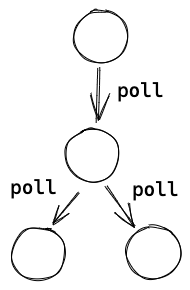

# Rust async 简介

在讲 Tokio 之前，不得不先讲一下 Rust 的异步编程，因为和很多语言不太一样。

*对于 Rust Async 熟悉的可以跳过这章*

对于 Erlang/Go/Nodejs 等语言，异步 runtime 都是内置于语言本身，开箱即用。但 Rust 作为一门系统级语言，并不想局限于一种实现，于是另辟蹊径，提供了 Future/async/await 等基本功能，实现了类似于 Nodejs Promise 的 task ，但把调度和运行 future 交给第三方实现，如 [Tokio](https://github.com/tokio-rs/tokio)、[async-std](https://github.com/async-rs/async-std)。例如下图，左边是 Rust 语言提供的基本功能，驱动了 task 的执行，而右边是第三方 runtime 需要实现的调度机制。


[https://excalidraw.com/#json=5287000177377280,_EjA-elJg02sgC71T8uXLQ](https://excalidraw.com/#json=5287000177377280,_EjA-elJg02sgC71T8uXLQ)

## Future, async, await

`Future` 是 Rust 的一个 trait（类似于 interface），表示一个异步任务（task），是"零成本"(zero-cost abstraction)的轻量级线程（类似 promise），会被交给 runtime 调度和执行。`Future` trait 需要实现 `poll` 这个方法，在 `poll`  中判断这个任务是否执行完，如果执行完（比如 IO 数据准备好），就返回 `Ready`，否则返回 `Pending`。

我们的代码不会直接调用 poll，而是通过 Rust 的关键字  `.await` 来执行这个 future，`await` 会被 Rust 在编译时生成代码来调用 `poll`，如果返回 `Pending` 则被 runtime 挂起（比如重新放到任务队列中）。当有 event 产生时，挂起的 future 会被唤醒，Rust 会再次调用 future 的 `poll`，如果此时返回 `Ready` 就执行完成。

除了直接实现 Future trait 以外，还可以通过 `async` 把一个 function 或者一个代码 block 转变为一个 Future。在 `async` 中可以调用其他 future 的 `.await` 来等待子 future 变成 Ready 状态。

```rust
struct HelloFuture { ready: bool, waker: ... }

impl Future for HelloFuture {          // 1. custom Future(leaf)
    fn poll(self: Self, ctx: &mut Context<'_>) -> Poll<()> {
        if self.ready {
            Poll::Ready(())
        } else {
            // store waker in ctx somewhere
            Poll::Pending
        }
    }
}

async fn hello_world() {                 // 2. generated Future by async
    println!("before await");
    HelloFuture { ready: false }.await;  // 3. HelloFuture is pending, then park
    println!("Hello, world!");
}

fn main() {
    let task = hello_world(); // 4. task is a generated Future
    // ... reactor code is ignored here, which will wake futures
    runtime::spawn(task);     // 5. task is run by runtime
}
```

例如上边这段代码，`HelloFuture` 是一个通过实现 `Future` trait 实现的 Future， `hello_world` 是 `async` 函数变成的 Future，并被传入 runtime 来执行（这里 `runtime::spawn` 只是示例）。`hello_world` 中又调用了 `HelloFuture.await`，因为 ready 是 false，所以 `hello_world` 会被挂起，直到 HelloFuture 被唤醒。

上述的这种嵌套的 futures 可以组成一个 Future 树，一般叶子节点都是由 runtime（如 Tokio） 自己通过实现 Future trait 来实现的，如 io、tcp、time 等操作。非叶子节点则由库代码或用户通过 `async` 调用不同的子 future 实现的。root future 会被提交给 runtime 来执行，runtime 通过调度器来调用 root future，然后 root 再一级级往下调用 poll。


[https://excalidraw.com/#json=6697978081312768,u9VYjoGonibMqcPX8VWeGg](https://excalidraw.com/#json=6697978081312768,u9VYjoGonibMqcPX8VWeGg)

## 生成状态机和 stackless

Future 会被 Rust 编译为一个状态机的代码，当执行到子 Future 的 `await` 的时候，会进入下一个状态，所以下次执行时可以从 `await` 的地方继续执行。因此 Rust 不需要预先为 future 分配独立的栈（stackless），是 zero-cost abstraction。但也因为如此，future 只能在 `await` 的地方调度走，是 cooperation scheduling（协同调度），而且很难做抢占式调度，这点和 stackful 的 Go/Erlang 不一样。状态机的示意伪代码如下：

```rust
use std::{future::Future, task::Poll};

enum HelloWorldState {
    Start,
    Await1(HelloFuture),
    Done,
}

impl Future for HelloWorldState {
    type Output = ();
    fn poll(&mut self: HelloWorldState, ctx: &mut Context<'_>) -> Poll<Output> {
        match self {
            HelloWorldState::Start => {
                println!("before await"); // code before await

                let hello = HelloFuture { ready: false };

                *self = HelloWorldState::Await1(hello);
                self.poll();              // re-poll after first state change
            },
            HelloWorldState::Await1(hello) => {
                match hello.poll(ctx) {      // await by poll
                    Poll::Pending => {
                        Poll::Pending
                    },
                    Poll::Ready(output) => {
                        println!("Hello, world!"); // code after await
                        *self = HelloWorldState::Done;
                        let output = ();
                        Poll::Ready(output)
                    }
                }
            },
            HelloWorldState::Done => {
                panic!("can't go here")
            }
        }
    }
}
```

在这段示意代码中， `async fn hello_world()` 被变成了一个 enum 的状态和它的 poll 方法，初始状态为 `Start`，第一次执行 `poll` 时会执行 `.await` 之前的代码，并改变当前状态为 `Await1` 。下次再被 `poll` 时，因为状态是 `Await1`，会进入第二个分支并执行 `hello.poll()`，如果 `hello` 还没完成，会返回 `Pending`，否则会执行 `.await` 之后的代码。

可以看到，Rust 主要提供了这些基础的工具和代码生成，而如何管理 OS 线程、如何调度任务、如何 poll events、如何唤醒 pending 的 tasks 等等，都需要 runtime 自己实现，可以实现为一个类似于 Erlang/Go 的 N:M 模型，也可以实现 Nodejs 这样单线程事件驱动的模型。

需要注意的是，如果使用了 async，很多标准库中的同步阻塞的库就不应该直接使用，否则会阻塞其他 task 的调度和运行。比如执行 `std::println!` 或者执行纯 CPU 计算的时候，因为没有 `.await` 这样的 yield point，所以无法被调度走，当前 OS 线程必须等到这个操作完成，执行到下一个 yield point 后，才能执行其他 task，这段时间内这个 OS 线程中的任务都被阻塞了。

一般 runtime 会封装好一些常用的模块，如 IO/TCP/timer 等等，写代码时注意使用 runtime 封装的而不用标准库的就行。像 Tokio 这样的 runtime 还提供了专门用来运行这类阻塞操作的专用线程池（类似于 Erlang 的 dirty scheduler），从而不影响 reactor 或者其他 task 的执行。

### 参考

* [https://rust-lang.github.io/async-book/](https://rust-lang.github.io/async-book/)
* [https://www.infoq.com/presentations/rust-async-await/](https://www.infoq.com/presentations/rust-async-await/)
